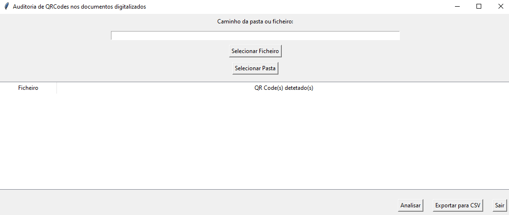

# 📄 **QRCode Auditor** — Validation and extraction of QRCodes in PDF and image documents



**QRCode Auditor** is a lightweight and efficient utility for scanning documents and extracting QRCodes. It helps identify digitalization issues, detect misindexed files, and ensure data integrity — especially in contexts like document management and GDPR compliance.

---

## 🚀 Key Features

- 📥 Supports **PDF**, **JPG**, **JPEG**, **BMP**, and **GIF** files
- 🔍 Bulk extraction of QRCodes (including multi-page PDFs)
- 🖥️ GUI-based visualization of results
- 🧾 Export QRCode data to **CSV**
- ⚠️ Automatically detects:
  - Multiple QRCodes in the same document
  - QRCode discrepancies (e.g. mismatched `"g"` keys across pages)

---

## 🛠 Installation and Setup

The script can be run directly in Python, or within a Jupyter Notebook using Visual Studio Code.

### Quick install using pip:

```bash
pip install pillow pdf2image pyzbar
```

> Note: Make sure the `zbar` native library is installed on your system for `pyzbar` to work.

---

### Recommended setup (MiniConda + VSCode)

1. Install [MiniConda](https://docs.anaconda.com/miniconda/install/)
2. Install [Visual Studio Code](https://code.visualstudio.com/Download)
   - Add the **Python** and **Jupyter** extensions in VSCode

### Create a conda environment:

```bash
conda create --name qrcode_audit python
conda activate qrcode_audit
pip install ipykernel pillow pdf2image pyzbar
```

Open VSCode in the project folder:

```bash
code .
```

In Jupyter, select the `qrcode_audit` kernel.

---

## 🧪 Use Cases and Motivation

This project was born from real-world needs to validate document integrity after digitalization. Common validation rules include:

1. Documents with **more than one QRCode** usually indicate **indexing errors**.
2. Documents with QRCodes containing **different `"g"` keys** may signal **cross-client data merging**, which could be a **GDPR violation**.

---

## 📬 Contributing

This is a personal project, but collaboration is welcome! 💡

Feel free to:
- Open **issues** with feature ideas or bugs
- Submit **pull requests** to improve the tool
- Share this repo with others who might find it helpful

Let’s build something valuable for the community together! 🚀

---

## 📄 License

This project is licensed under the MIT License — free to use, modify, and distribute!